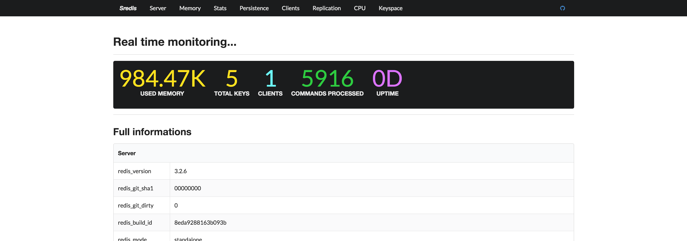

# Sredis

[](https://nodei.co/npm/sredis/)


Sredis is another redis monitoring tool written in javascript.

## Screenshots



## Installation

Global installation.

```
npm install -g sredis
```

Install as a node module.

```
npm install --save sredis
```

## Usage

Command line usage.

```
> sredis -h 127.0.0.1 -p 6379 -a passwd -o ./logs.csv

# show helps
> sredis --help
  Usage: sredis [options]

  Options:

    -h, --help                output usage information
    -V, --version             output the version number
    -v --version              get version
    -h --host <host>          Server hostname (default: 127.0.0.1).
    -p --port <port>          Server port (default: 6379).
    -a --auth <password>      Password for redis server.
    -o --output <filepath>    Output to csv file.
    -i --interval <interval>  Refresh interval, mileseconds (default: 3000).

```

Module usage.

```
const Sredis = require('sredis')

let mywatcher = new Sredis({
  host: '', // redis server host(optional), default: 127.0.0.1
  port: '', // redis server port(optional), default: 6379
  password: '', // redis server password(optional)
  output: '', // csv filepath(optional)
  interval: '', // refresh interval, mileseconds(optional), default: 3000
})
```

## Events

* event#watching

* event#statusUpdated

  ```
  mywatcher.on('statusUpdated', function(latestStatus){
    /*
    	  got latest status.
    	  {
          Server: {},
          Client: {}
          ...
    	  }
    */
  })
  ```

* event#historyUpdated

  ```
  mywatcher.on('historyUpdated', function(history){
    /*
    	  here got seven history status.
    	  [
          {
            Server: {},
            Client: {}
            ...
          }
          ...
    	  ]
    */
  })
  ```

  ​

* event#scriptsLoaded

  Lua script loaded.

* event#error

  Handle error events youself, or they will just be thrown out.

---

#### License: MIT

#### Author: [cyyyu](https://github.com/cyyyu)


